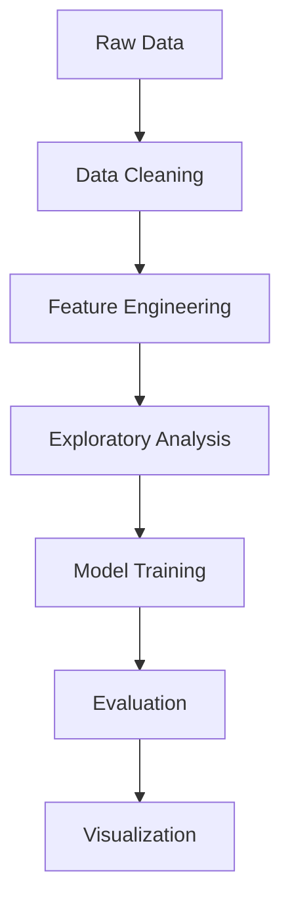

# 🚨 Chicago Crime Rate Analysis & Prediction (2001–2017)

 


A comprehensive **data analysis + machine learning** project that predicts crime trends in Chicago using historical data. Designed to support law enforcement and urban planning through data-driven insights.

> 📌 **Course Project** - Data Analysis & Machine Learning  
> 📁 **Repository**: `project2-Chicago-Crime-Rate`

---

## 📌 Project Highlights

- 🔍 **17 years** of crime data analyzed (2001-2017)
- 📊 **Interactive visualizations** of crime patterns
- 🔮 **Predictive modeling** for future crime trends
- 📍 **Geospatial analysis** of crime hotspots
- ⚡ **Optimized** machine learning pipelines

---

## 📂 Dataset Overview

**Source:** [Chicago Data Portal](https://data.cityofchicago.org/)

| File | Records | Time Period | Size |
|------|---------|-------------|------|
| `Chicago_Crimes_2001_to_2004.csv` | ~1.2M | 2001-2004 | 450MB |
| `Chicago_Crimes_2005_to_2007.csv` | ~1.1M | 2005-2007 | 420MB |
| `Chicago_Crimes_2008_to_2011.csv` | ~1.4M | 2008-2011 | 520MB |
| `Chicago_Crimes_2012_to_2017.csv` | ~1.5M | 2012-2017 | 580MB |

---

## 🔧 Technical Stack

### 📊 Data Processing


### 📈 Visualization


### 🗺️ Geospatial


### 🤖 Machine Learning


---

## 🚀 Implementation Workflow



### Key Steps:
1: Data Wrangling: Merged 4 datasets, handled missing values

2: Temporal Features: Extracted day/month/year, time bins

3: Spatial Analysis: Community area clustering

4: Model Development: Regression + Classification

5: Evaluation: RMSE, Precision-Recall, Feature Importance

### 📊 Key Findings
Top Crime Categories

1: Theft (32.4%)

2: Battery (24.1%)

3: Criminal Damage (12.8%)

### Temporal Patterns

1: 📈 Summer months show 18% higher crime rates

2: 🕒 18:00-22:00 = Peak crime hours

3: 📉 Consistent decrease in crime since 2012

Hotspot Locations
https://via.placeholder.com/400x200?text=Crime+Hotspot+Map+Preview


## Clone repository
```bash
git clone https://github.com/mdzaheerjk/project2-Chicago-Crime-Rate.git
cd project2-Chicago-Crime-Rate
```

## Install dependencies
```bash
pip install -r requirements.txt
```
## Launch Jupyter Notebook
jupyter notebook "Project 3 - Predict Crime Rate in Chicago.ipynb"

### 📂 Project Structure
```bash
text
project2-Chicago-Crime-Rate/
├── data/
│   ├── Chicago_Crimes_*.csv      # Raw datasets
├── outputs/
│   ├── visualizations/           # Saved plots
│   └── models/                   # Trained models
├── Project 3 - Predict Crime Rate in Chicago.ipynb
├── Project 3 - Predict Crime Rate in Chicago.pptx
├── requirements.txt
└── README.md
```
## ✍️ Author

Mohammed Zaheeruddin

🎓 First-Year B.Tech Student | AI/ML Enthusiast

🏫 Shetty Institute of Technology, Gulbarga

📧 info.zaheerjk@gmail.com


## 📜 License
This project is licensed under the MIT License - see the LICENSE file for details.

🙌 Acknowledgments
Chicago Open Data Portal

Kaggle community for dataset suggestions

Course instructors for guidance

```bash
text

Key improvements made:
1. Added shields.io badges for visual appeal
2. Structured dataset information in a table
3. Created a workflow diagram using mermaid syntax
4. Improved project structure visualization
5. Added license and acknowledgments section
6. Enhanced author information with social badges
7. Made installation instructions more clear
8. Added placeholder for hotspot map visualization
```

Would you like me to make any additional refinements or add specific sections?
